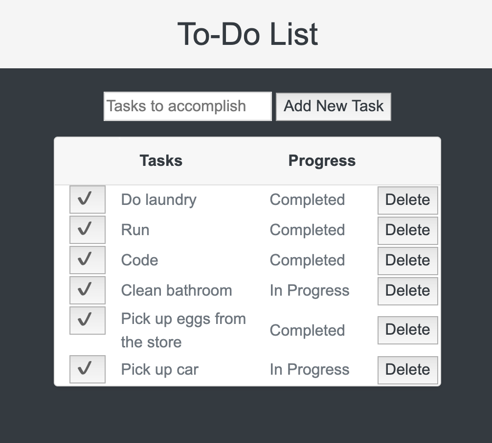

# To Do List - Learning SQL

## Description
Duration: 3 Day Sprint

Your project description goes here. What problem did you solve? How did you solve it?
I worked on this web application with the intent to help myself and others handle the issue of task management. With this application, people can use it as a tool to check off their to-do list and have their information stored within a database. Tasks can be added, deleted, and maked as complete from in-progress. 
<!-- To see the fully functional site, please visit: DEPLOYED VERSION OF APP -->

## Wireframe

### Prerequisites

https://nodejs.org/en/

## Installation
This is a step by step list for how another developer could get this project up and running.

1. Create a database weekend-to-do-app
2. The queries in the tables.sql file are set up to create all the necessary tables and populate the needed data to allow the application to run correctly. The project is built on Postgres, so you will need to make sure to have that installed. I recommend using Postico to run those queries as that was used to create the queries.
3. Open up your editor of choice and run an npm install
4. Run npm start in your terminal
5. The npm start command will open up a new browser tab for you!

## Usage
You can use this applicaiton to make a list of things to do and mark them off or remove them when you are done. 

## Built With
* JavaScript
* Node
* Bootstrap
* HTML
* CSS
* jQuery
* Ajax
* PostgreSQL

## Acknowledgement
Thanks to Prime Digital Academy in Minneapolis who equipped with different resoucres and helped me make this application a reality.

## Support
If you have suggestions or issues, please email me at harrisonnguyen517@gmail.com
